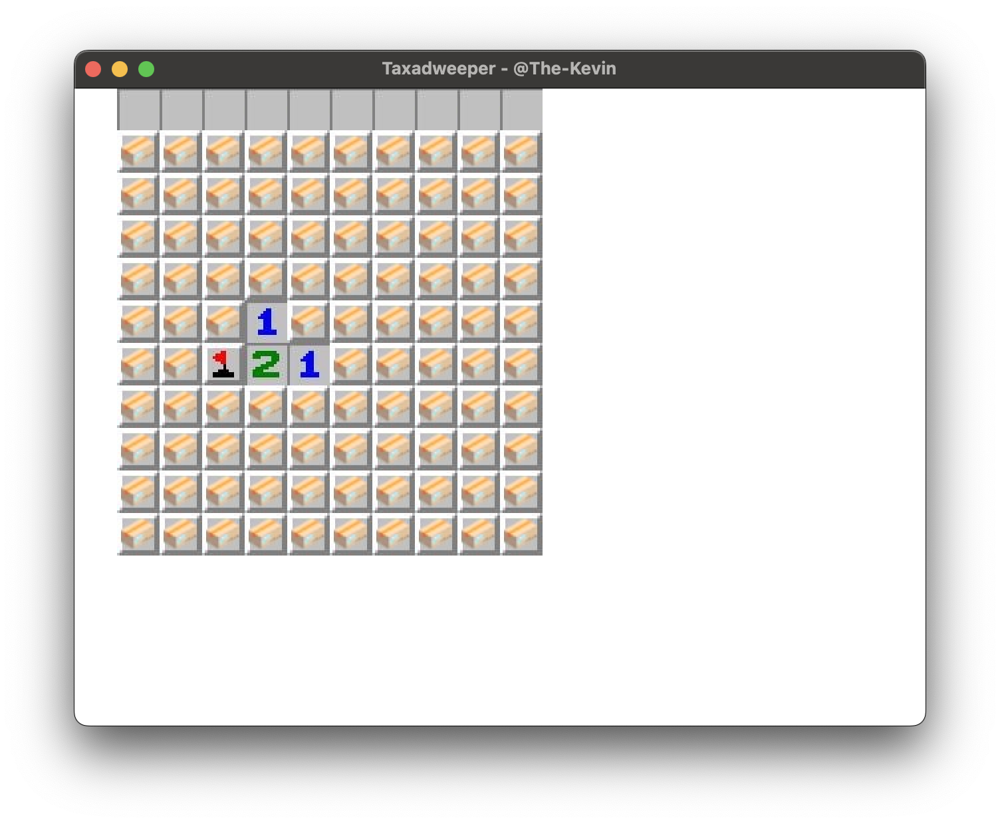
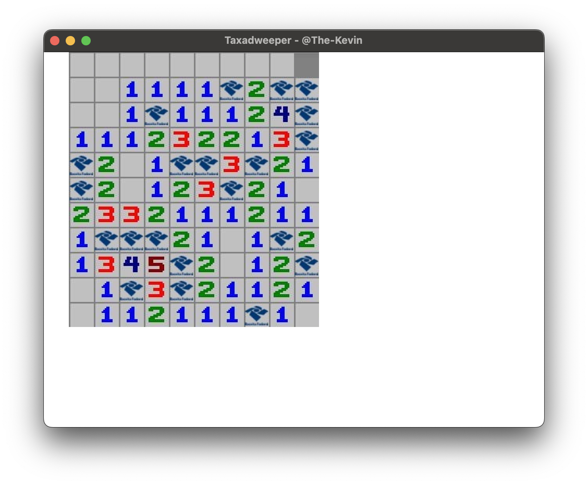
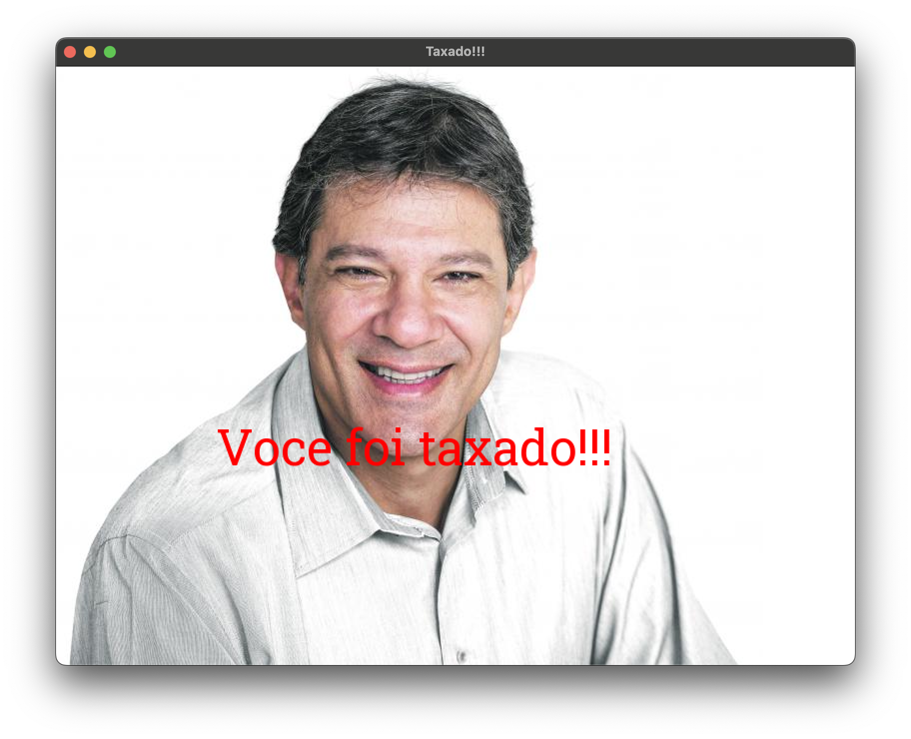

### Bem vindo ao Taxadweeper 📦

Seu objetivo aqui é comprar o maximo de produtos de sites chineses sem ser pego pela receita federal!

Caso voce compre uma encomenda rastreada pela Receita Federal o Taxad irá atras de voce!

Bom jogo e boa sorte!

## Atencao

O objetivo deste jogo nao é caluniar, difamar ou causar qualquer problema a imagem de qualquer figura publica, muito menos ser utilizado como propaganda politica por eventuais partidos ou politicos de oposicao. O objetivo deste jogo é apenas realizar de maneira inocente e divertida uma satira, além de ser uma publicidade ao meu trabalho como programador
Caso qualquer partido ou politico se sinta ofendido pela publicacao, por favor entrar em contato comigo pelo comentario da postagem ou por email [kevin.almeida1111.ka@gmail.com](mailto:kevin.almeida1111.ka@gmail.com?subject=REMOVE_TAX_GAME) e tanto o jogo quanto qualquer publicacao feita por mim, o criador do jogo, será removida além das devidas desculpas em publico!

## Requerimentos do jogo

- MacOS Sonoma ou posterior
- clang++ compilador
- SFML instalado

## Como executar o jogo

- Primeiro instale o SFML com o brew utilizando o comando `brew install sfml`
- Em seguida execute o inicio da compilacao dos arquivos utilizando o arquivo Makefile com o comando
  `make`
- O arquivo binario com o jogo estará em `/bin/app`
- O jogo poderá ser executado com o comando `./bin/app`
